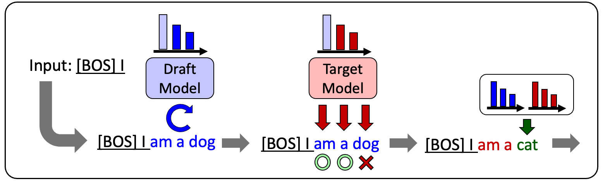

# japanese-speculative-decoding

[English](README_EN.md)



「日本語投機的デコーディングの検討」で使用したコード一式。

- 投機的デコーディング(Speculative Decoding; [*Leviathan et al. 2022*](https://arxiv.org/abs/2211.17192), [*Chen et al. 2023*](https://arxiv.org/abs/2302.01318))の再現実装
- KV-cache・BetterTransformer・量子化と組み合わせた場合の実装
- XLSumによる効果検証用コード
- [効果検証で使用した日本語言語モデル](#models)

## Requirements

- pyenv
- poetry
- CUDA environments

## Usage

### 1. [pyproject.toml](pyproject.toml)の編集

使用するCUDA環境に合わせて、`torch`のダウンロードリンクを編集してください。Pytorchのバージョンは2.0.0を推奨します。
Pytorchのダウンロードリンク一覧は[こちら](https://download.pytorch.org/whl/torch/)

```pyproject.toml
torch = { url = "YOUR_TORCH_LINK"}  # Should be replaced with your environment
```

### 2. 環境設定

pyenvとpoetryにより、このプロジェクト用の仮想環境を立ち上げます。

```sh
# pyenvとpoetryの確認
pyenv --version
poetry --version

# (任意)仮想環境内部に.venvを配置する設定
poetry config virtualenvs.inproject true

# Python環境のインストールと立ち上げ
pyenv install 3.9
pyenv local 3.9
poetry install
```

### 3.　実行

投機的デコーディングによるテキスト生成を実行します。

```sh
poetry run python main.py \
    --input "INPUT_SENTENCE" \
    --decode "speculative" \
    --target-model ${HF_TARGET_MODEL_PATH} \
    --draft-model ${HF_DRAFT_MODEL_PATH}
```

日本語XLSumによるベンチマークテストを行うには`--input`オプションの代わりに`--benchmark`オプションを指定してください。
`--decode`オプションはデフォルトで`auto_regressive`になっているため、投機的デコーディングによるテキスト生成を行うには`speculative`を明示的に指定してください。その他のオプションについては[main.py](./main.py)を確認してください。

## Models

効果検証で使用した事前学習済みモデルおよび日本語XLSumによる追加学習済みモデルを公開しています。
詳細は各モデルのリンクを確認してください。

|# of params| 事前学習済みモデル | 追加学習済みモデル (日本語XLSum)|
| --- | --- | --- |
| 6M |[japanese-gpt-neox-6M](https://huggingface.co/u-hyszk/japanese-gpt-neox-6M)|[japanese-gpt-neox-6M-xlsum-sft](https://huggingface.co/u-hyszk/japanese-gpt-neox-6M-xlsum-sft)|
| 13M |[japanese-gpt-neox-13M](https://huggingface.co/u-hyszk/japanese-gpt-neox-13M)|[japanese-gpt-neox-13M-xlsum-sft](https://huggingface.co/u-hyszk/japanese-gpt-neox-13M-xlsum-sft)|
| 29M |[japanese-gpt-neox-29M](https://huggingface.co/u-hyszk/japanese-gpt-neox-29M)|[japanese-gpt-neox-29M-xlsum-sft](https://huggingface.co/u-hyszk/japanese-gpt-neox-29M-xlsum-sft)|
| 47M |[japanese-gpt-neox-47M](https://huggingface.co/u-hyszk/japanese-gpt-neox-47M)|[japanese-gpt-neox-47M-xlsum-sft](https://huggingface.co/u-hyszk/japanese-gpt-neox-47M-xlsum-sft)|
| 72M |[japanese-gpt-neox-72M](https://huggingface.co/u-hyszk/japanese-gpt-neox-72M)|[japanese-gpt-neox-72M-xlsum-sft](https://huggingface.co/u-hyszk/japanese-gpt-neox-72M-xlsum-sft)|
| 115M |[japanese-gpt-neox-115M](https://huggingface.co/u-hyszk/japanese-gpt-neox-115M)|[japanese-gpt-neox-115M-xlsum-sft](https://huggingface.co/u-hyszk/japanese-gpt-neox-115M-xlsum-sft)|
| 165M |[japanese-gpt-neox-165M](https://huggingface.co/u-hyszk/japanese-gpt-neox-165M)|[japanese-gpt-neox-165M-xlsum-sft](https://huggingface.co/u-hyszk/japanese-gpt-neox-165M-xlsum-sft)|
| 247M |[japanese-gpt-neox-247M](https://huggingface.co/u-hyszk/japanese-gpt-neox-247M)|[japanese-gpt-neox-247M-xlsum-sft](https://huggingface.co/u-hyszk/japanese-gpt-neox-247M-xlsum-sft)|
| 409M |[japanese-gpt-neox-409M](https://huggingface.co/u-hyszk/japanese-gpt-neox-409M)|[japanese-gpt-neox-409M-xlsum-sft](https://huggingface.co/u-hyszk/japanese-gpt-neox-409M-xlsum-sft)|

## Results

本レポジトリのコード・モデルを使用した効果検証の結果は[こちら](RESULTS.md)をご覧ください

## License

検証用モデルのtokenizerとして使用した[open-calm-1b](https://huggingface.co/cyberagent/open-calm-1b)のライセンスに基づき、本レポジトリのコード・モデルも同じくCC BY-SA 4.0ライセンスで公開します。詳しくは[こちら](https://creativecommons.org/licenses/by-sa/4.0/)をご覧ください。

## Reference

```bibtex
@article{hayashizaki2024speculative,
  year = 2024,
  author = {林崎由,能勢隆,伊藤彰則},
  title = {日本語投機的デコーディングの検討},
  journal = {言語処理学会第30回年次大会}
}
```
