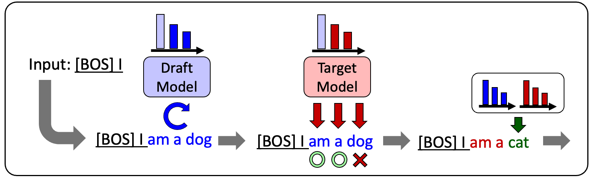

# japanese-speculative-decoding

[Japanese](README.md)



A set of codes used in the "A Study of Speculative Decoding in Japanese"

- Reproducible implementation of Speculative Decoding([*Leviathan et al. 2022*](https://arxiv.org/abs/2211.17192), [*Chen et al. 2023*](https://arxiv.org/abs/2302.01318))
- Implementation when combined with KV-cache, BetterTransformer, and quantization
- Code for effect verification by Japanese XLSum
- [Japanese language model used in effect verification](#models)

## Requirements

- pyenv
- poetry
- CUDA environments

## Usage

### 1. Edit [pyproject.toml](pyproject.toml)

Please edit the `torch` download link according to your CUDA environment. 2.0.0 version of Pytorch is recommended.
The list of download links for Pytorch is [here](https://download.pytorch.org/whl/torch/)

```pyproject.toml
torch = { url = "YOUR_TORCH_LINK"}  # Should be replaced with your environment
```

### 2. Virtual Enviroment Setup

Set up a virtual environment for this project with pyenv and poetry.

```sh
# Check pyenv and poetry
pyenv --version
poetry --version

# (Optional) Setup to place .venv inside the virtual environment
poetry config virtualenvs.inproject true

# Install and launch the python virtual environment
pyenv install 3.9
pyenv local 3.9
poetry install
```

### 3.　Run

Run text generation with speculative decoding.

```sh
poetry run python main.py \
    --input "INPUT_SENTENCE" \
    --decode "speculative" \
    --target-model ${HF_TARGET_MODEL_PATH} \
    --draft-model ${HF_DRAFT_MODEL_PATH}
```

To perform benchmark testing with Japanese XLSum, specify the `--benchmark` option instead of the `--input` option.
The `--decode` option is `auto_regressive` by default, so to generate text by speculative decoding, specify `-speculative` explicitly. For other options, see [main.py](./main.py).

## Models

Pre-trained models used in the test and fine-tuned models by Japanese XLSum are available.
Please check the link of each model for details.

|# of params| pre-trained models | fine-tuned models (Japanese XLSum)|
| --- | --- | --- |
| 6M |[japanese-gpt-neox-6M](https://huggingface.co/u-hyszk/japanese-gpt-neox-6M)|[japanese-gpt-neox-6M-xlsum-sft](https://huggingface.co/u-hyszk/japanese-gpt-neox-6M-xlsum-sft)|
| 13M |[japanese-gpt-neox-13M](https://huggingface.co/u-hyszk/japanese-gpt-neox-13M)|[japanese-gpt-neox-13M-xlsum-sft](https://huggingface.co/u-hyszk/japanese-gpt-neox-13M-xlsum-sft)|
| 29M |[japanese-gpt-neox-29M](https://huggingface.co/u-hyszk/japanese-gpt-neox-29M)|[japanese-gpt-neox-29M-xlsum-sft](https://huggingface.co/u-hyszk/japanese-gpt-neox-29M-xlsum-sft)|
| 47M |[japanese-gpt-neox-47M](https://huggingface.co/u-hyszk/japanese-gpt-neox-47M)|[japanese-gpt-neox-47M-xlsum-sft](https://huggingface.co/u-hyszk/japanese-gpt-neox-47M-xlsum-sft)|
| 72M |[japanese-gpt-neox-72M](https://huggingface.co/u-hyszk/japanese-gpt-neox-72M)|[japanese-gpt-neox-72M-xlsum-sft](https://huggingface.co/u-hyszk/japanese-gpt-neox-72M-xlsum-sft)|
| 115M |[japanese-gpt-neox-115M](https://huggingface.co/u-hyszk/japanese-gpt-neox-115M)|[japanese-gpt-neox-115M-xlsum-sft](https://huggingface.co/u-hyszk/japanese-gpt-neox-115M-xlsum-sft)|
| 165M |[japanese-gpt-neox-165M](https://huggingface.co/u-hyszk/japanese-gpt-neox-165M)|[japanese-gpt-neox-165M-xlsum-sft](https://huggingface.co/u-hyszk/japanese-gpt-neox-165M-xlsum-sft)|
| 247M |[japanese-gpt-neox-247M](https://huggingface.co/u-hyszk/japanese-gpt-neox-247M)|[japanese-gpt-neox-247M-xlsum-sft](https://huggingface.co/u-hyszk/japanese-gpt-neox-247M-xlsum-sft)|
| 409M |[japanese-gpt-neox-409M](https://huggingface.co/u-hyszk/japanese-gpt-neox-409M)|[japanese-gpt-neox-409M-xlsum-sft](https://huggingface.co/u-hyszk/japanese-gpt-neox-409M-xlsum-sft)|

## Results

See [HERE](RESULTS.md) for the results of the test using the codes and models in this repository.

## License

Based on the license of [open-calm-1b](https://huggingface.co/cyberagent/open-calm-1b), which was used as the tokenizer for the pre-trained models, the codes and models in this repository is also released under the CC BY-SA 4.0 license. For more information, please see [HERE](https://creativecommons.org/licenses/by-sa/4.0/).

## Reference

```bibtex
@article{hayashizaki2024speculative,
  year = 2024,
  author = {Yu Hayashizaki,Takashi Nose,Akinori Ito},
  title = {A Study of Speculative Decoding in Japanese},
  journal = {30th Annual Meeting of the Language Processing Society of Japan}
}
```
